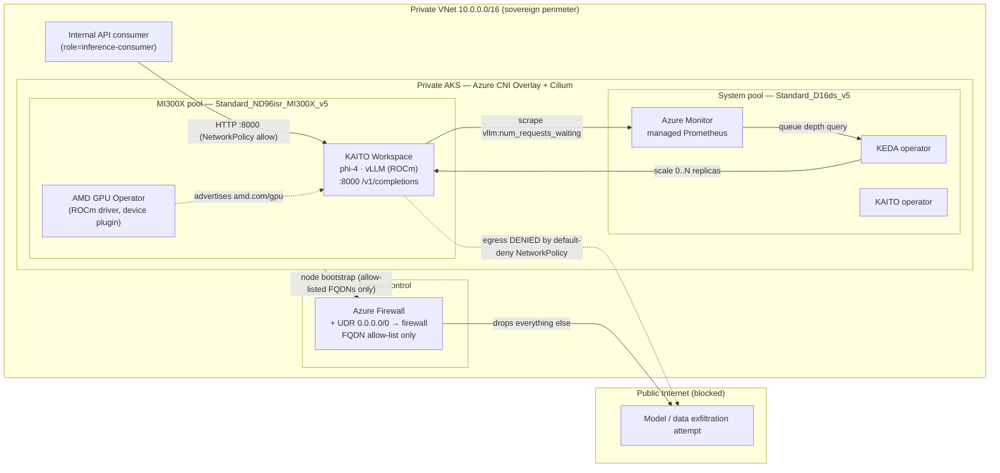

# Sovereign, air-gapped SLM inference on AKS with AMD MI300X, KAITO and KEDA


[](https://portal.azure.com/#create/Microsoft.Template/uri/https%3A%2F%2Fraw.githubusercontent.com%2FAzure%2Fazure-quickstart-templates%2Fmaster%2Fquickstarts%2Fmicrosoft.containerservice%2Faks-sovereign-ai-inference-baseline%2Fazuredeploy.json/createUIDefinitionUri/https%3A%2F%2Fraw.githubusercontent.com%2FAzure%2Fazure-quickstart-templates%2Fmaster%2Fquickstarts%2Fmicrosoft.containerservice%2Faks-sovereign-ai-inference-baseline%2FcreateUiDefinition.json)
[](https://portal.azure.us/#create/Microsoft.Template/uri/https%3A%2F%2Fraw.githubusercontent.com%2FAzure%2Fazure-quickstart-templates%2Fmaster%2Fquickstarts%2Fmicrosoft.containerservice%2Faks-sovereign-ai-inference-baseline%2Fazuredeploy.json)
[](http://armviz.io/#/?load=https%3A%2F%2Fraw.githubusercontent.com%2FAzure%2Fazure-quickstart-templates%2Fmaster%2Fquickstarts%2Fmicrosoft.containerservice%2Faks-sovereign-ai-inference-baseline%2Fazuredeploy.json)

This template deploys an **air-gapped, event-driven Small Language Model (SLM) inference platform** on Azure Kubernetes Service, optimized for high data-sovereignty environments (for example the EU Data Boundary / Sweden Central). It provisions a hardened private virtual network, an Azure Firewall that locks down all egress via user-defined routing, and a private AKS cluster running **AMD Instinct MI300X** GPUs. Models are served with **KAITO** on a ROCm **vLLM** runtime and autoscaled with **KEDA** on inference queue depth, while CKS-grade zero-trust **Cilium NetworkPolicies** enforce a strict air-gap to protect model IP and prompt data.

> **Two-phase deployment.** The Deploy to Azure button (or `azuredeploy.json`) provisions the **infrastructure** — private VNet, firewall/UDR, identity, Azure Monitor, and the private AKS cluster with the KAITO and KEDA add-ons enabled. Because the API server is private, the in-cluster steps (AMD GPU Operator, NetworkPolicies, KAITO Workspace, KEDA `ScaledObject`) are applied afterward by [`scripts/deploy.sh`](./scripts/deploy.sh), which runs `kubectl`/`helm` through `az aks command invoke`. See [Deploy this scenario](#deploy-this-scenario).

## Architecture



## Dataflow

1. An **internal API consumer** running inside the private VNet (labelled `role=inference-consumer`) sends an OpenAI-compatible request to the vLLM service on port `8000`. A Cilium `NetworkPolicy` admits this traffic; no ingress from outside the VNet is possible because the cluster is private and the workload namespace is default-deny.
2. The **KAITO Workspace** serves the request on a **phi-4** model using the ROCm-optimized **vLLM** runtime, scheduled onto an **AMD Instinct MI300X** node (`accelerator=mi300x`). The **AMD GPU Operator** has already installed the ROCm driver and advertises the `amd.com/gpu` resource, since AKS delegated GPU driver management to the operator (`installGPUDriver=false`).
3. vLLM continuously exports Prometheus metrics — including the queue-depth gauge `vllm:num_requests_waiting` — which **Azure Monitor managed Prometheus** scrapes via a `ServiceMonitor`.
4. **KEDA** queries that metric from the Azure Monitor workspace (authenticated with Entra **Workload Identity**) and adjusts the replica count of the KAITO-managed deployment: it **bursts** on rising queue depth and **scales back to zero** when idle, so no MI300X GPU is billed while unused. The cluster-autoscaler adds/removes MI300X nodes to match.
5. Every attempt by a workload pod to reach the **public internet** is **dropped** by the default-deny egress `NetworkPolicy` (only cluster DNS is allowed). At the node level, all outbound traffic is force-tunnelled through **Azure Firewall** via a UDR and permitted only to a small allow-list of AKS-required FQDNs — enforcing the air-gap for model weights and prompt data.

## Components

- **[Azure Kubernetes Service (AKS)](https://learn.microsoft.com/azure/aks/)** — Private cluster (no public API endpoint) with Azure CNI Overlay, the Cilium dataplane and Cilium network policy. Hosts a system node pool (`Standard_D16ds_v5`) and a GPU user pool (`Standard_ND96isr_MI300X_v5`). The **AI toolchain operator (KAITO)** and **KEDA** are enabled as managed add-ons.
- **[Azure Virtual Network](https://learn.microsoft.com/azure/virtual-network/)** — Hardened `10.0.0.0/16` network with isolated subnets for system and GPU workloads, per-subnet NSGs, and a route table for forced-tunnel egress.
- **[Azure Firewall](https://learn.microsoft.com/azure/firewall/)** — Central egress choke point. A UDR sends `0.0.0.0/0` to the firewall, whose policy allows only the FQDNs AKS needs to bootstrap and pull images — everything else is denied.
- **[KAITO (Kubernetes AI Toolchain Operator)](https://github.com/kaito-project/kaito)** — Declaratively provisions and serves the open-source **phi-4** SLM on the ROCm vLLM runtime, targeting the MI300X pool.
- **[KEDA](https://keda.sh/)** — Event-driven autoscaler that scales inference replicas (including scale-to-zero) on the vLLM request-queue-depth metric.
- **[AMD GPU Operator](https://github.com/ROCm/gpu-operator)** — Owns the ROCm driver + device-plugin lifecycle and advertises `amd.com/gpu`.
- **[AMD Instinct MI300X](https://www.amd.com/en/products/accelerators/instinct/mi300/mi300x.html)** — 192 GB HBM3 per GPU (8 per node), 5.3 TB/s memory bandwidth — the compute serving the model.
- **[Azure Monitor managed Prometheus + Container Insights](https://learn.microsoft.com/azure/azure-monitor/)** — Metrics source for KEDA and cluster observability, backed by Log Analytics.

## Well-Architected Framework considerations

The [Azure Well-Architected Framework](https://learn.microsoft.com/azure/well-architected/) is a set of guiding tenets used to improve the quality of a workload. The following considerations map this architecture to the five pillars.

### Reliability

- **No dropped requests under burst.** KEDA scales the deployment on `vllm:num_requests_waiting`, so a spike in telemetry/inference load queues in vLLM and triggers additional replicas rather than shedding requests. `scaleUp` uses a zero-second stabilization window to react immediately; `scaleDown` uses a 5-minute window to avoid flapping.
- **Capacity headroom.** The cluster-autoscaler provisions MI300X nodes between the configured min and max; the system pool spans **three availability zones** with surge upgrades to keep platform add-ons (KAITO, KEDA, Prometheus) highly available.
- **Self-healing GPU stack.** The AMD GPU Operator manages driver rollouts with `maxUnavailableNodes: 1`, protecting serving capacity during upgrades.

### Security

- **Strict air-gap protecting IP.** The workload namespace is **default-deny** ingress and egress. The only egress exception is cluster DNS; there is deliberately no `0.0.0.0/0` allow rule, so model weights and prompts cannot leave the perimeter. Cilium (eBPF) enforces these `NetworkPolicies` in the dataplane.
- **Private everything.** The AKS API server is private, node egress is force-tunnelled through Azure Firewall with an FQDN allow-list, local accounts are disabled, and access uses Entra ID with Azure RBAC. Secrets are brokered by Workload Identity (no static credentials on the cluster).
- **Least privilege.** The cluster's user-assigned identity holds Network Contributor scoped only to the route table and VNet — never subscription-wide.

### Cost Optimization

- **One GPU per large model — no sharding tax.** A single MI300X exposes **192 GB of HBM3**, enough to hold an unquantized ~70B-parameter model in the memory of one accelerator. That avoids the tensor-parallel sharding required when a model exceeds the ~80 GB found on comparable NVIDIA parts, eliminating cross-GPU communication overhead and the extra GPUs (and interconnect) needed just to fit the weights.
- **No paying for idle GPUs.** KEDA scales serving replicas to **zero** when there is no queued work, and the cluster-autoscaler removes idle MI300X nodes — you pay for accelerators only while requests are in flight.

### Operational Excellence

- **No manual driver toil.** The AMD GPU Operator installs and upgrades the ROCm driver and device plugin; AKS is configured with `installGPUDriver=false` so there is a single, declarative owner of the GPU lifecycle.
- **No manual model/container toil.** KAITO turns model serving into a declarative `Workspace` resource — it provisions the runtime, wires the service, and reconciles drift — removing bespoke Dockerfiles and serving scripts.
- **Everything as code.** Infrastructure is modular Bicep; cluster state is Kubernetes manifests; deployment and validation are idempotent scripts.

### Performance Efficiency

- **Memory-bandwidth wins throughput.** LLM decode is memory-bandwidth bound. The MI300X delivers **5.3 TB/s** of HBM3 bandwidth, feeding the compute units faster during token generation and raising sustained tokens/sec for the interactive, memory-bound inference in this scenario.
- **Right-sized scheduling.** GPU pods request `amd.com/gpu` and are pinned to MI300X nodes via labels/taints, while KEDA keeps replica count matched to real-time demand.

## Prerequisites

- An Azure subscription with **quota for `Standard_ND96isr_MI300X_v5`** in the target region (check `az vm list-usage`).
- The **object ID of an Entra ID group** to grant cluster-admin via Azure RBAC.
- `az` CLI (≥ 2.60), Bicep, and permission to create the resource group and role assignments.
- For a fully air-gapped cluster: a private Azure Container Registry mirroring the AMD GPU Operator chart/images, the ROCm vLLM image, and the consumer image, plus the corresponding FQDNs added to the firewall policy.

## Deploy this scenario

### 1. Infrastructure (portal or CLI)

Click **Deploy to Azure** above (it presents a guided form via `createUiDefinition.json`), or deploy from the command line:

```bash
az group create -n rg-slm-sovereign -l swedencentral
az deployment group create \
  -g rg-slm-sovereign \
  -f main.bicep \
  -p location=swedencentral clusterAdminGroupObjectId=<entra-group-guid>
```

### 2. Cluster configuration and workloads

Run the idempotent script, which installs the AMD GPU Operator, applies the zero-trust NetworkPolicies, wires KEDA Workload Identity, and deploys the KAITO Workspace and KEDA `ScaledObject` — all through `az aks command invoke` against the private API server:

```bash
RESOURCE_GROUP=rg-slm-sovereign \
LOCATION=swedencentral \
CLUSTER_ADMIN_GROUP_OBJECT_ID=<entra-group-guid> \
./scripts/deploy.sh
```

### 3. Validate

```bash
RESOURCE_GROUP=rg-slm-sovereign ./scripts/test_inference.sh
```

The suite asserts (1) MI300X GPUs are advertised and the vLLM pod is scheduled on an MI300X node, (2) `/v1/completions` returns HTTP 200 within the latency budget, (3) the pod **cannot** reach the public internet — the test passes only when exfiltration is dropped — and (4) the KEDA `ScaledObject` is active.

## Usage

### Connect

Because the cluster is private, run `kubectl` through the API server tunnel:

```bash
az aks command invoke -g rg-slm-sovereign -n slmair-prod-aks \
  --command "kubectl get workspace,scaledobject,pods -n inference -o wide"
```

### Management

- Inspect autoscaling: `kubectl describe scaledobject phi-4-inference -n inference`
- Inspect GPU health: `kubectl get deviceconfig -n kube-amd-gpu`
- Tear down: `az group delete -n rg-slm-sovereign --yes --no-wait`

## Notes

- The Deploy button badges above are populated automatically by the Azure Quickstart Templates test pipeline once the sample is merged; they will render as "not tested" until then.
- MI300X capacity and the ROCm vLLM image are region- and registry-dependent; review the [Prerequisites](#prerequisites) before deploying.

`Tags: AKS, Kubernetes, AMD, MI300X, ROCm, vLLM, KAITO, KEDA, SLM, LLM, inference, air-gapped, sovereignty, Cilium, NetworkPolicy, Well-Architected, Microsoft.ContainerService/managedClusters, Microsoft.Network/azureFirewalls, Microsoft.Monitor/accounts`
